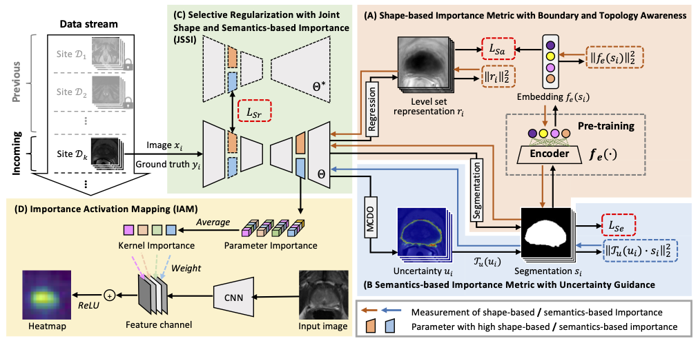
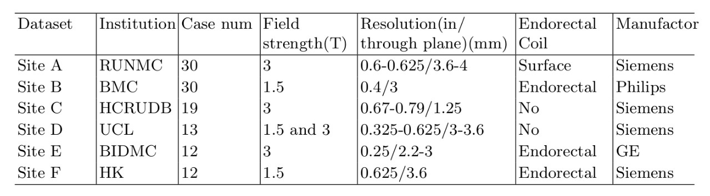

# $S{^3}R$: Shape and Semantics-based Selective Regularization for Explainable Continual Segmentation across Multiple Sites

Here is the implementation for paper:

**Comprehensive Importance-based Selective Regularization for Continual Segmentation across Multiple Sites.** (https://link.springer.com/chapter/10.1007/978-3-030-87193-2_37) (conference version)

**$S^3R$: Shape and Semantics-based Selective Regularization for Explainable Continual Segmentation across Multiple Sites** (journal version is in submission)



### Introduction

In clinical practice, a segmentation network is often required to continually learn on a sequential data stream from multiple sites rather than a consolidated set.
However, during the continual learning process, existing methods are usually restricted by the poor network memorizability on previous sites when learning from images from a new site.
In this project, we tackle an interesting problem setting of continual segmentation across multiple sites, by proposing a shape and semantics-based selective regularization ($S^3R$) to enhance both shape and semantic memory.

### Usage

#### 1. Data preprocessing
Multi-site prostate MR images can be found [HERE](https://liuquande.github.io/SAML/), collected from six different data sources out of three public datasets. 
The preprocessing pipeline in dataloder follows Quande's work, such as [SAML](https://github.com/liuquande/SAML) and [FedDG](https://github.com/liuquande/FedDG-ELCFS).


#### 2. Model Training
Run `train.py`, where training configurations are specified. 
This calls `regularization_CISR.py`, where network structure and training function are defined:
```
python run train.py --agent_type regularization_CISR --agent_name Reg_CISR --model_type seg_regression --model_name Unet_regression
```
Note that in each learning round, the segmentation embedding module need to be pre-trained as suggested by [ACNN](https://ieeexplore.ieee.org/abstract/document/8051114). 

### Citations
If you make use of the code, please cite:
```
@article{zhang2021CISR,
  title={Comprehensive Importance-based Selective Regularization for Continual Segmentation across Multiple Sites},
  author={Zhang, Jingyang and Gu, Ran and Wang, Guotai and Gu, Lixu},
  journal={International Conference on Medical Image Computing and Computer Assisted Intervention},
  year={2021}
}
```

### Questions
For further question about the code or dataset, please contact 'zjysjtu1994@gmail.com'
